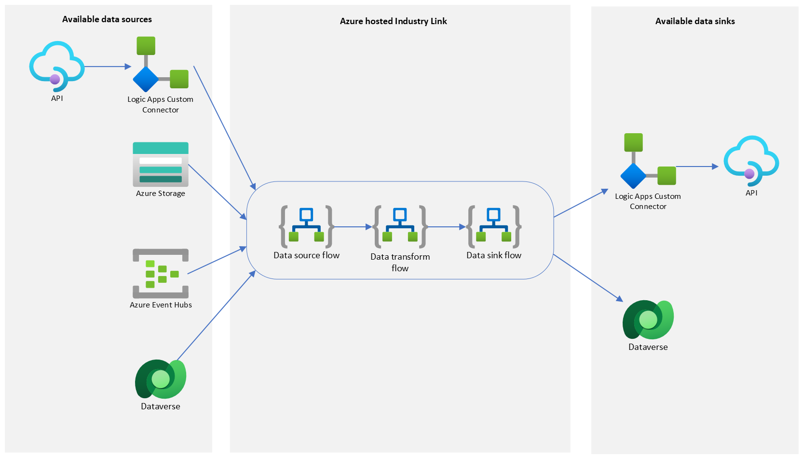

# Azure hosted Industry Link

## Overview

This Industry Link solution option utilizes Azure to integrate your data with Microsoft Dataverse. A set of modular Logic Apps are created to facilitate the data transfer and basic transformation requirements between your data source and sink.



The Logic Apps are packaged into an Azure deployment package which contains the ARM templates required to deploy the required Azure resources to your Azure environment. You can also make your Industry Link available for external customers by using this package as part of your offer when publishing to the Azure Marketplace.

Once published to Partner Center, a customer is able to install the Industry Link template into their own Azure subscription with a single step:
1. Install the Industry Link into your Azure subscription via the offer in Azure Marketplace.

## Get started building your Industry Link

This repository provides the [MsIndustryLinks](scripts/modules/MsIndustryLinks/README.md) PowerShell module that can be used to configure the templates and create the assets required to build an Industry Link. 

To get started building your Industry Link, you will need to ensure you have the following prepared:
- An Azure subscription
- A [Microsoft Partner Center](https://learn.microsoft.com/en-us/power-platform/developer/appsource/register-microsoft-partner-network) account, if you want to make your Industry Link available for public use

### Install MsIndustryLinks module

```powershell
cd scripts/modules

# Build the module file
./BuildModule.ps1 -ModuleDirectory ./MsIndustryLinks

# Import the module
Import-Module -Name MsIndustryLinks
```

### Identify your data source and configure workflow

#### Logic App Custom Connectors (API data source/sink only)

A Logic App custom connector is required for an Industry Link to transfer data using an API. It is wrapper around an API to obfuscate the configuration details and enables integration with Logic Apps.

When a custom connector is initially created, it is created as a non-certified custom connector. This only allows your custom connector to be shared within your organization. Your custom connector will need to go through the custom connector certification process if it needs to be made publicly available. Industry Links supports non-certified and certified custom connectors.

Currently, there are no helper cmdlets in [MsIndustryLinks](scripts/modules/MsIndustryLinks/README.md) to configure and create a Logic App custom connector. The use of custom connectors in Azure hosted solutions only currently support API key authentication. These may become available as we receive feedback.
See [Create a custom connector in Azure Logic Apps](https://learn.microsoft.com/en-us/connectors/custom-connectors/create-logic-apps-connector) to learn more about how to create a Logic App custom connector.

#### Configure data source, transform and sink

Create a configuration file for the workflow with the required parameters for your use case. See [logicapp_workflow.json.tmpl](scripts/modules/MsIndustryLinks/templates/logicapp_workflow.json.tmpl) for examples of the workflow configuration file.

|                 |                                                                       |
| --------------- | --------------------------------------------------------------------- |
| Data sources    | Azure Blob Storage, Custom Connector (API key), Dataverse, Event Hubs |
| Data transforms | CSV to JSON                                                           |
| Data sinks      | Custom Connector (API key), Dataverse                                 |

The custom connector data source and sink supports both certified and non-certified connectors. Currently, only the API key security method is supported. More security methods will be added in the future.

A certifed custom connector allows the connector to be publicly available for all users. See the [Custom Connectors documentation](scripts/modules/MsIndustryLinks/customConnector/CustomConnector.md) to learn more about certifying your custom connector.

A non-certified custom connector can only be shared with users in your subscription. This is an option for testing your Industry Link while your custom connector is being certified. Non-certified Logic App custom connectors will be deployed to the same resource group as the Industry Link. When generating the Industry Link ARM templates, you can simply provide the Swagger API definition file for your custom connector.

### Generate workflow templates and deployable solution

#### Generate Industry Link

##### Generate the Logic App Industry Link workflow templates

```powershell
New-MsIndustryLink
    -WorkflowConfigFile logicapp_workflow.json
    -OutputDirectory templates
```

The output directory will contain the Industry Link Logic App workflow templates that pass data from the source to the sink, optionally transforming the data in between.

##### Generate the ARM templates for deploying the Industry Link to Azure

```powershell
New-AzureDeploymentPackage
    -WorkflowConfigFile logicapp_workflow.json
    -TemplateDirectory templates
    -OutputDirectory output
```

The output directory will contain the ARM templates for deploying the Industry Link to Azure and the application offer's marketplacePackage.zip file for publishing the offer to Azure Marketplace.

##### Test deployment of the Industry Link to Azure

```powershell
New-AzureDeployment
    -ResourceGroup contosorg
    -Location eastus
    -TemplatesFolder output
    -ParametersFile parameters.json
    -StorageAccountName mystorageaccount
```

A storage account is required to upload the linked ARM templates for deployment. If you don't already have an existing storage account, you can create one. Replace "MyResourceGroup" with your own resource group name.

```
az group create --name MyResourceGroup --location westus
az storage account create -n mystorageacct -g MyResourceGroup -l westus --sku Standard_LRS
```

The parameters.json file contains the parameters for the deployment. See [parameters.json.tmpl](scripts/modules/MsIndustryLinks/package/azureDeploymentPackage/parameters.json.tmpl) for an example of the format.

### Publish your Industry Link

To make your Industry Link publicly available to all users in the Azure Marketplace, you will need to generate an Azure Marketplace application (solution template) offer in Partner Center.

Please refer to [Publishing to Azure Marketplace](scripts/modules/MsIndustryLinks/publish/application/AzureMarketplacePublishing.md) for more information on how to publish your Industry Link to Azure Marketplace.

```powershell
New-AzureApplicationOffer
    -AssetsDirectory listingAssets
    -MarketplacePackageZipFile marketplacePackage.zip
    -OfferName contoso-industry-link
    -PlanName contoso-industry-link
```
