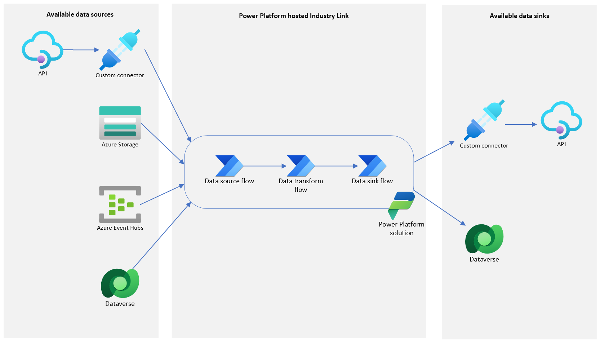

# Power Platform hosted Industry Link

## Overview

This Industry Links solution option utilizes the Power Platform to integrate your data with Microsoft Dataverse. A set of modular Power Automate flows are created to facilitate the data transfer and basic transformation requirements between your data source and sink.



The Power Automate flows are packaged into a Power Platform solution that enables easy importing into your Power Platform environment. You can also make your Industry Link available for external customers by using this solution as part of your offer when publishing to AppSource.

Once published to AppSource, a customer is able to install the Industry Link template into their own Power Platform environment with the following steps:
1. Install the Industry Link into your Power Platform environment via the offer in AppSource.
2. Set the flow connections to provide your authentication details for your data source and sink.
3. Turn on the Cloud Flows.

For more detailed steps on the customer installation experience, please see [Installing an Industry Link from AppSource](./PowerPlatformHostedCustomerExperience.md).

## Get started building your Industry Link

This repository provides the [MsIndustryLinks](scripts/modules/MsIndustryLinks/README.md) PowerShell module that can be used to configure the templates and create the assets required to build an Industry Link. 

To get started building your Industry Link, you will need to ensure you have the following prepared:
- A Power Platform development environment with a license that supports premium connectors
- A [Microsoft Partner Center](https://learn.microsoft.com/en-us/power-platform/developer/appsource/register-microsoft-partner-network) account, if you want to make your Industry Link available for public use

### Install MsIndustryLinks module

```powershell
cd scripts/modules

# Build the module file
./BuildModule.ps1 -ModuleDirectory ./MsIndustryLinks

# Import the module
Import-Module -Name MsIndustryLinks
```

### Identify your data source and configure workflow

#### Power Platform Custom Connectors (API data source/sink only)

A custom connector is required for an Industry Link to transfer data using an API. It is wrapper around an API to obfuscate the configuration details and enables integration with Power Automate flows.

When a custom connector is initially created, it is created as a non-certified custom connector. This only allows your custom connector to be shared within your organization. Your custom connector will need to go through the custom connector certification process if it needs to be made publicly available. Industry Links supports non-certified and certified custom connectors.

Within the [MsIndustryLinks](scripts/modules/MsIndustryLinks/README.md) module, there are some commands available to help configure and create your custom connector. See [Power Platform Custom Connectors](scripts/modules/MsIndustryLinks/customConnector/CustomConnectorCertification.md) to learn more.

To create an Industry Link with a non-certified connector, an Azure AD application is required to obtain the required configuration details of your custom connector via the Dataverse Web API. See the [Microsoft Dataverse documentation](https://learn.microsoft.com/en-us/power-apps/developer/data-platform/build-web-applications-server-server-s2s-authentication) to associate an Azure AD application with your Dataverse environment.

#### Configure data source, transform and sink

Create a configuration file for the workflow with the required parameters for your use case. See [flow_workflow.json.tmpl](scripts/modules/MsIndustryLinks/templates/flow_workflow.json.tmpl) for an example of the workflow configuration file.

|                 |                                                             |
| --------------- | -----------------------------------------------             |
| Data sources    | Azure Blob Storage, Custom Connector, Dataverse, Event Hubs |
| Data transforms | CSV to JSON                                                 |
| Data sinks      | Custom Connector, Dataverse                                 |

If your data source or sink is a non-certified custom connector, create an [authentication config file](scripts/modules/MsIndustryLinks/templates/auth.json.tmpl), adding in the Azure AD application details prepared earlier.

### Generate workflow templates and deployable solution

#### Configure package parameters

Create a parameters file for the workflow packaging with the required parameters for your use case. See [package.parameters.json.tmpl](scripts/modules/MsIndustryLinks/package/powerPlatformSolution/package.parameters.json.tmpl) for an example.

A Power Platform Solution Publisher is required to create the solution. Since the solution publisher specifies who developed the solution, you should create your own publisher instead of using the the default. A Solution Publisher includes a prefix, which is a mechanism to avoid naming collisions of components.

Please refer to the [Create a solution publisher](https://learn.microsoft.com/en-us/power-apps/maker/data-platform/create-solution#create-a-solution-publisher) for more information on how to create a Power Platform solution publisher and prefix.

#### Generate Industry Link

##### Example 1: Generate a Flow Industry Link package

```powershell
New-MsIndustryLink
    -WorkflowConfigFile flow_workflow.json
    -OutputDirectory output
    -PackageParametersFile package.parameters.json
```

The output directory will contain the Power Platform solution containing the Industry Link workflows that pass data from the source to the sink. A solution zip file is also in the output directory ready to be imported into your Dataverse environment and published to AppSource.

### Publish your Industry Link

To make your Industry Link available to users outside of your organization in AppSource, you will need to generate and publish an AppSource offer in Partner Center. 

Please refer to [Publishing to Microsoft AppSource](scripts/modules/MsIndustryLinks/publish/appsource/AppSourcePublishing.md) for more information on how to publish your Industry Link to AppSource.
