# Customer Experience installing a Power Platform hosted Industry Link 

Take the following steps to install the Power Platform Industry Link template from AppSource. 

## Step 1: Install from AppSource 

Install the Industry Link into the environment. 

1. Go to the Industry Link in AppSource and select **Install**.

    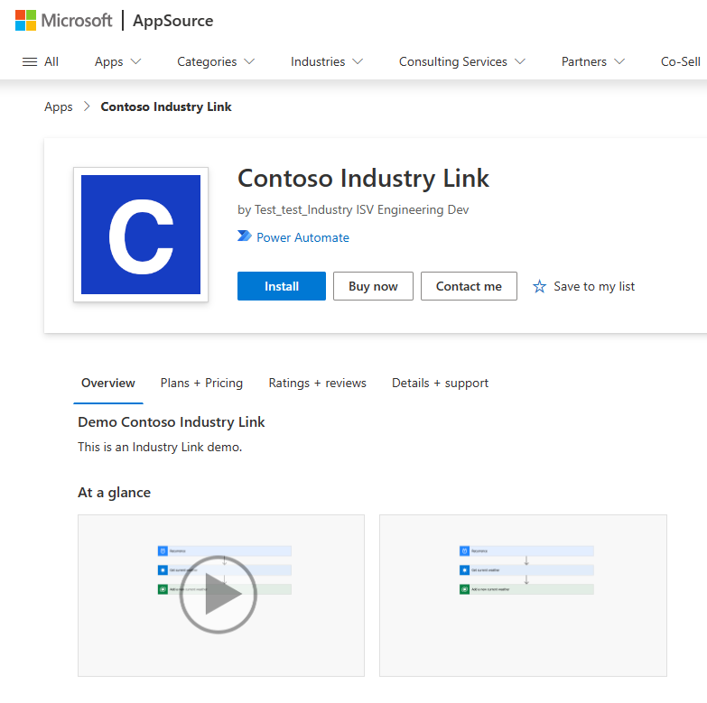

2. Confirm your details and select **Install**.

    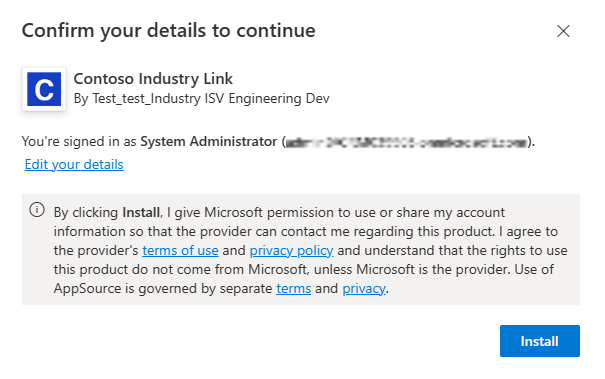

3. Select the environment that you want to install the solution template into.

    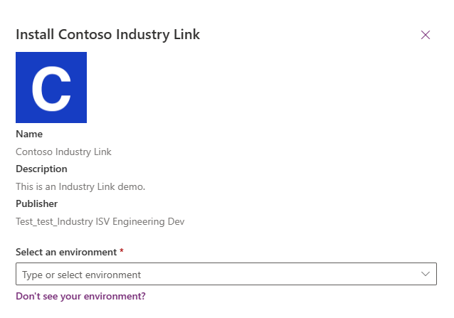

4. Agree to the Terms and Privacy Statements by checking the boxes.
5. Select **Install**. You'll be taken to a screen where you can view the installation status. After the installation is complete, the status shows as *Installed*.

## Step 2: Set flow connections 

1. Open the Industry Link solution by selecting the **ContosoIndustryLink** in the **Solutions** tab.

    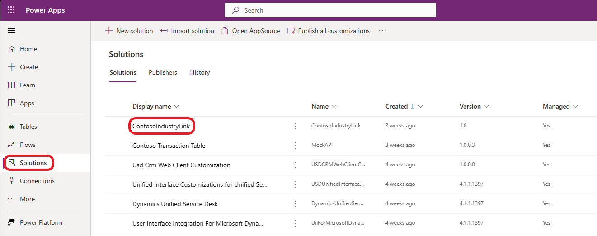

2. Go to **Cloud Flows**. There are two cloud flows that require editing:
    - **GetDataFromCustomConnector**
    - **IngestIntoDataverse**
3. Edit the *IngestIntoDataverse* flow:
    1. Select the *IngestIntoDataverse* flow.

        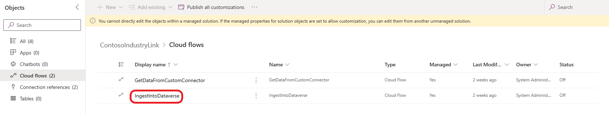

    2. Select **Edit** -> **Edit with designer** in the top-left corner.
   
        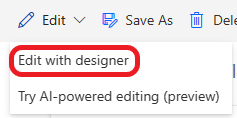

    3. Select **Sign In** on the Microsoft Dataverse connection.
   
        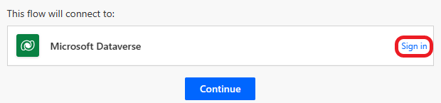

    4. Enter your credentials or pick an existing account to authenticate with Dataverse. If a connection already exists, it will automatically connect to it when you selected Sign In.
    5. Select **Continue**.

        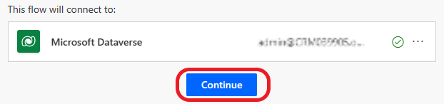

    6. Select **Save** in the top toolbar.
    7. Select the back arrow to return to the solution.
4. Edit the *GetDataFromCustomConnector*:
    1. Select the *GetDataFromCustomConnector* flow.

        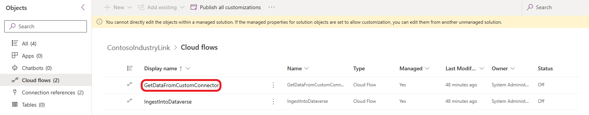

    2. Select **Edit** -> **Edit with designer** in the top-left corner.

        

    3. Select **+ New connection reference** to create a connection to the *ContosoIndustryLinkAPI* custom connector.

        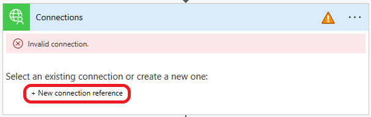

    4. Enter the connection name and credentials to authenticate with the custom connector.
    5. Select **Create**.
    6. Select **Save** in the top toolbar.
    7. Select the back arrow to return to the solution.

## Step 3: Set Cloud Flows to On 

In the Industry Link (*ContosoIndustryLink*) solution, verify that the two cloud flows are set to the on status. If they aren't, turn them on.

1. Select the *IngestIntoDataverse* cloud flow. Select **Turn on** in the top toolbar.

    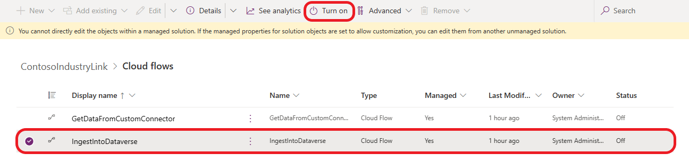

2. Select the *GetDataFromCustomConnector* cloud flow. Select **Turn on** in the top toolbar.

    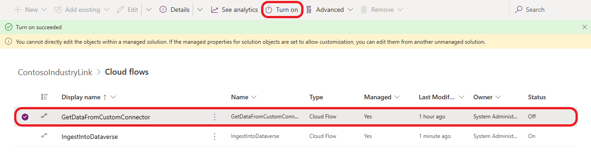
 